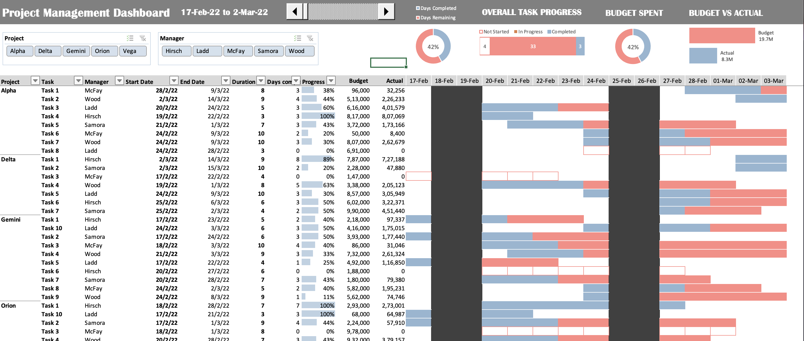

# Managing Multiple Project Progress

## Importance of Project Management:

The truth is, running projects without good project management is a false economy. Without PM, teams and 
clients are exposed to chaotic management, unclear objectives, a lack of resources, unrealistic planning, 
high risk, poor quality project deliverables, projects going over budget and delivered late.

Great project management matters because project managers with great training deliver success.

Project management creates and enables happy, motivated teams who know their work matters, so do their best work. 
And that project management enabled team ensures the right stuff is delivered; stuff that delivers real return on 
investment, and that makes happy clients. It enables: 
- Strategic Alignment
- Leadership
- Clear Focus & Objectives
- Realistic Project Planning
- Quality Control
- Risk Management
- Continuous Oversight etc.

## Project Dashboard:

When it comes to managing and analyzing projects, you wish to have an intelligent system to keep track 
of your projects, and that’s where project dashboards come into the picture. A project management dashboard is a 
data dashboard designed to display metrics, stats, insights, and key performance indicators related to specific 
projects at one central location.

It is a single interface that helps you visualize, monitor, optimize, and enhance 
the performance of your projects. It serves as a real-time monitoring tool for all your projects so that you can decide 
what’s working, what’s not, and what changes need to be done to achieve your goals.

## The Project:

**Dashboard Sneek Peek:**

In this project, I have built a project management dashboard in Excel that would enable managers to effectively monitor the progress
of multiple projects at a time. The dashboard shows several key metrics including the names of the projects, tasks related to a project, 
the manager assigned for a task, start and end dates, progress, budget allocated and the actual expenses etc. It even uses a timeline to show which days were
 effective and on which days people were sitting idle.
 
It can be further segregated by project type, project manager and specific time periods to have an even granular visualisation of the projects.

## The Dataset:

The data for this project was randomly generated, and had 40 observations spread along 9 columns as follows:
| Column  | Description |
|---------|-------------|
| Project | Name of the project |
| Task  | Task number for a given project |
| Manager | Manager assigned to a specific task |
| Start Date  | Date when work on the task began  |
| Duration  | Tentative time needed for work on the task to finish  |
| End Date  | Date when work on the task is expected to finish  |
| Days Completed  | Days of work completed on a task  |
| Progress  | Overall work progress of a task  |
| Budget  | Budget allocated for a task |
| Actual  | Actual expenses for a task  |
