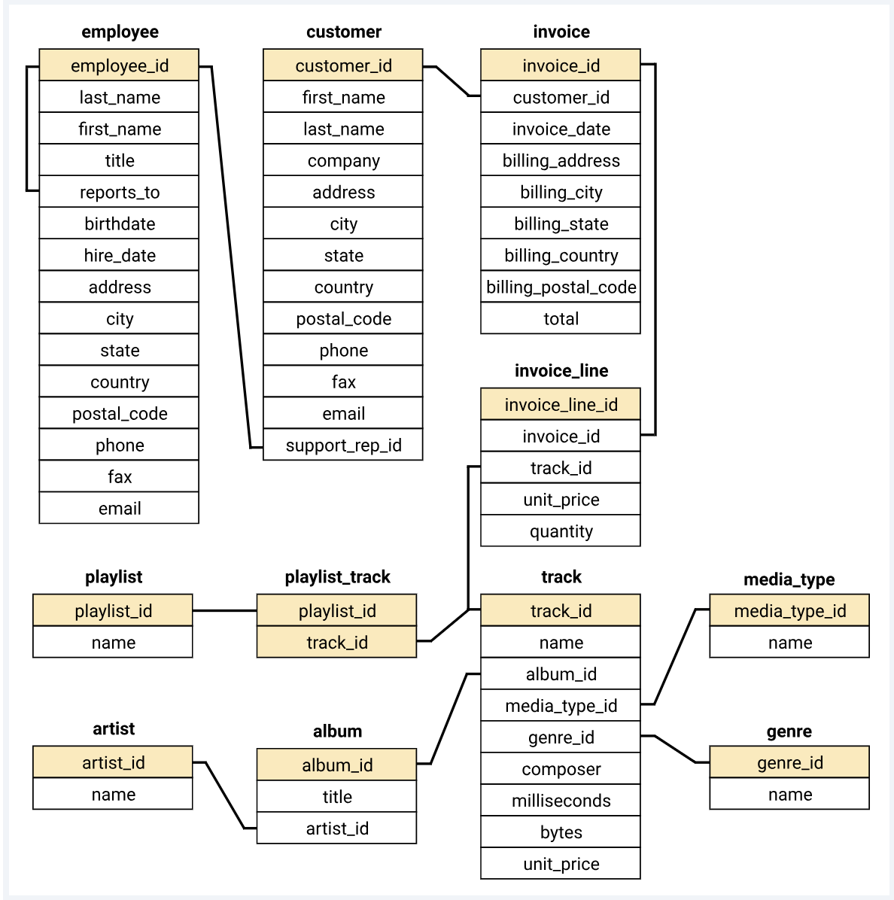

# **Business Optimisation Analysis of Chinook Digital Music Store**

## Importance of Business Optimisation:
Business optimisation is the process of improving the efficiency, productivity and performance of an organisation. 
It is the idea of consistently striving for better outcomes. This can apply both to internal operations and external products. 
Key elements of business optimisation include:

- Measurement of productivity, efficiency and performance
- Identifying areas for improvement
- Introducing new methods and processes
- Measuring and comparing results
- Repeating the cycle

Some examples of business optimisation include:

- Introducing new methods, practices and systems that reduce turnaround time
- Reducing costs while improving performance
- Automation of repetitive tasks
- Increasing sales through enhancing customer satisfaction etc.

## The Project:
Hence, in this project I have conducted an analysis for Chinook, an imaginary digital music store, to help optimise their business. 
The analysis done can help the company in identifying:

- Most profitable genres
- Performance of sales support agents
- Suitable marketing campaign to boost sales in least profitable countries
- Best city to organise a music festival in
- Effect of changing purchasing strategy to save money
- Sales boosting strategy through highest selling artists
- Type of concert to hold and the artists to invite that would maximise participation
- Customer reward system for the top spenders in each country

## The Datasets:
The database has been collected from the [github repo](https://github.com/lerocha/chinook-database) of [Luis Rocha](https://github.com/lerocha). 
The Chinook data model represents a digital media store, including tables for artists, albums, media tracks, invoices and customers. 
Media related data was created using real data from an iTunes Library. Customer and employee information was manually created using fictitious names, 
addresses that can be located on Google maps, and other well formatted data (phone, fax, email, etc.). 
Sales information is auto generated using random data for a four year period.

### Database Schema:
**Schema Diagram:**

There are 11 tables in the database as follows:

**Album Table:**
| Column  | Description |
|---------|-------------|
| AlbumId | Unique ID for each album  |
| Title | Name of the album |
| ArtistId  | ID of the artist who wrote the album  |

**Artist Table:**
| Column  | Description |
|---------|-------------|
| ArtistID  | Unique ID for each artist |
| Name  | Name of the artist  |

**Customer Table:**
| Column  | Description |
|---------|-------------|
| CustomerID  | Unique ID for each customer |
| FirstName | First name of customer  |
| Last Name | Last name of customer |
| Company | Customer's company  |
| Address | Customer's address  |
| City  | Customer's city |
| State | Customer's state  |
| Country | Customer's  country |
| PostalCode  | Customer's postal code  |
| Phone | Customer's phone number |
| Fax | Customer's fax number |
| Email | Customer's email address  |
| SupportRepID  | ID of the Sales Representative assigned to the customer |

**Employee Table:**
| Column  | Description |
|---------|-------------|
| EmployeeID  | Unique ID for each employee |
| FirstName | First name of employee  |
| Last Name | Last name of employee |
| Title | Employee's job title  |
| ReportsTo | Manager ID the employee reports to |
| BirthDate | Date of birth of employee |
| Address | Employee's address  |
| City  | Employee's city |
| State | Employee's state  |
| Country | Employee's  country |
| PostalCode  | Employee's postal code  |
| Phone | Employee's phone number |
| Fax | Employee's fax number |
| Email | Employee's email address  |

**Genre Table:**
| Column  | Description |
|---------|-------------|
| GenreId | Unique ID for each genre  |
| Name  | Name of the genre |

**Invoice Table:**
| Column  | Description |
|---------|-------------|
| InvoiceId | Unique ID for each invoice  |
| CustomerId  | ID of the customer who made the purchase  |
| InvoiceDate | Date of purchase  |
| BillingAddress  | Billing address for the purchase  |
| BillingCity | Billing city for the purchase  |
| BillingState  | Billing state for the purchase  |
| BillingCountry  | Billing country for the purchase  |
| BillingPostalCode | Billing postal code for the purchase  |
| Total | Total amount of the invoice |

**InvoiceLine Table:**
| Column  | Description |
|---------|-------------|
| InvoiceLineId | Unique ID for each invoice line |
| InvoiceId | ID of the invoice for the invoice line  |
| TrackId | ID of the track in the order  |
| UnitPrice | Price of each track in the order  |
| Quantity  | Quantity of each track purchased  |

**MediaType Table:**
| Column  | Description |
|---------|-------------|
| MediaTypeId | Unique ID for each media type |
| Name  | Name of the media type  |

**Playlist Table:**
| Column  | Description |
|---------|-------------|
| PlaylistId  | Unique ID for each playlist |
| Name  | Name of the playlist  |

**PlaylistTrack Table:**
| Column  | Description |
|---------|-------------|
| PlaylistId  | ID for the playlist |
| TrackId | ID of the track in the playlist |

**Track Table:**
| Column  | Description |
|---------|-------------|
| TrackId | Unique ID for each track  |
| Name  | Name of the track |
| AlbumId | ID of the album the track belongs to |
| MediaTypeId | ID of the media type the track belongs to |
| GenreId | ID of the genre the track belongs to |
| Composer  | Name of the composer of the track |
| Milliseconds  | Length of the track in milliseconds |
| Bytes | Size of the track in bytes  |
| UnitPrice | Price of each track |
