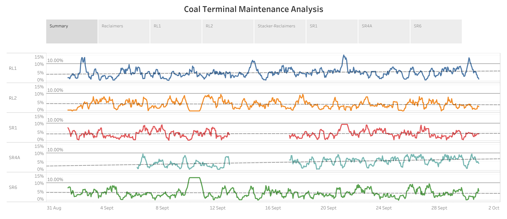

# Coal Terminal Maintenance Analysis

A reclaimer is a large machine used in bulk material handling applications. A reclaimer's function is to recover bulk materials from a stockpile, and is especially important in coal terminals. These machines run literally round the clock 24/7 for 365 days a year. Every minute of downtime equates to millions of dollars of lost revenue. Therefore, it is crucial to identify exactly when these machines require maintenance (neither less or more frequently is acceptable). 

Hence in this project I have tried to assess, for a coal terminal, which of its current fleet of reclaimer machines require maintenance in the upcoming month. For that, I have used the following criterion: a reclaimer requires maintenance when within the previous month there was at least one 8-hour period when the average idle capacity was over 10%, where idle capacity is a utilisation metric defined as (actual tonnage - nominal capacity) / nominal capacity. 

I have completed the project on Tableau where I calculated the percentage difference across the machines, and computed an 8-hour moving average over the date axis to mark instances when the average when beyond the 10% threshold specified in the problem statement. I have also added trendlines with the help of linear regressions to show possible future maintenance of the machines. 

The insights drawn from the visualisation has been reported as a storyline with detailed observations for each of the 5 reclaimers of the coal terminal.

Click <a href="https://public.tableau.com/app/profile/rafsan.al.mamun/viz/CoalTerminalMaintenanceAnalysis_16699226212560/CoalTerminalMaintenanceAnalysis">here</a> for the complete visualisation.

**Sneek Peek:**

## The Dataset:

The data used in this project has been randomly generated and contains the nominal capacity and actual tonnage for each of the machines, and the time when they were recorded.
