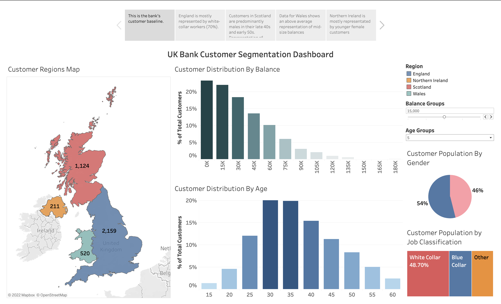

# Customer Segmentation of a Bank in Different Regions of UK

Customer segmentation is the process of dividing customers into groups based on common characteristics. This practice is as old as sales itself and is particularly vital for businesses that rely on customer loyalty or repeat purchases.

Luckily, as businesses have digitized their practices, it's easier than ever to gain insights about the customer base and customer segments. Customer segmentation dashboards can help with data visualization and provide with valuable insights into the customer base. It is a tool that automatically combines customer data into a single location. Such tools help businesses focus their marketing strategy to improve retention and reduce churn. 

With that in mind, I have created a Customer Segmentation Dashboard for a bank in the UK, with the help of Tableau. The project separated the dashboard in terms of a storyline to provide better insight into the customer segmentation in different regions of UK. 

The customer distribution has been segregated by region, balance groups, age groups, gender and job classifications. This dashboard can aid the bank in focusing their marketing efforts for a niche in different regions.

Click <a href="https://public.tableau.com/app/profile/rafsan.al.mamun/viz/CustomerSegmentationofaBankinDifferentRegionsofUK/CustomerSegmentationinDifferentRegionsofUK">here</a> for the complete visualisation.

**Sneek Peek:**

