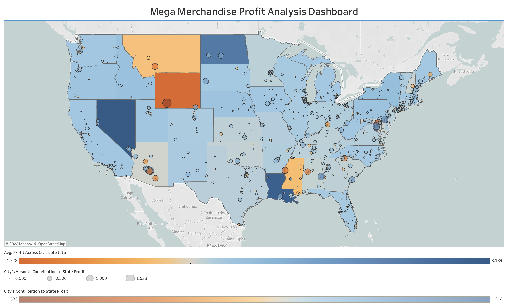

# Mega Merchandise Profit Analysis

Profit-focused dashboards are considered financial visualisation tools and are often used by executives and board members to analyse budget variances and trends related to profitability. Companies and organisations use these to give executives a quick and easy way to analyse gross margin and net profit metrics. 

When used as part of good business practices in a Financial Planning & Analysis department, a company can improve its executives’ ability to always keep an eye on these essential KPIs, as well as, reduce the chances that important decisions are delayed because executives don’t have easy, self-service insight to performance.

In this project, built in Tableau, a retail chain operating in the US wished to visualise their national sales and profits across all the states in a single map of the country. The visualisation uses LOD calculations to illustrate the average profit across the cities of a particular state, and the percent contribution of the profits of the respective cities towards the overall profit of that state, all in a single map of the US. 

This would allow the top management of the company to assess their key players that contribute to their overall profit, and find weaklings that they can further analyse to boost their sales.

Click <a href="https://public.tableau.com/app/profile/rafsan.al.mamun/viz/MegaMerchandiseProfitAnalysisViz/MegaMerchandiseProfitAnalysisDashboard">here</a> for the complete visualisation.

**Sneek Peek:**

