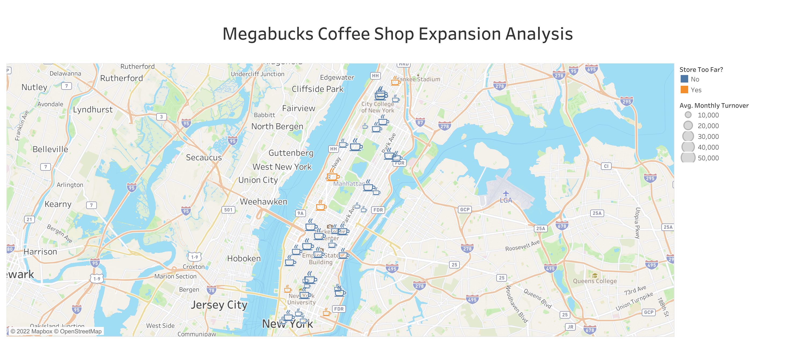

# Megabucks Coffee Shop Expansion Analysis

The Megabucks Coffee Company wished to be assisted in analysing the locations of their stores in Manhattan (NYC). They will be opening new stores, and need to prioritise locations based on their latest vision. 

In their vision, they are aiming to ensure that their customers will never be more than a ½ mile away from one of their stores. The priority will therefore be to close the gaps between the existing stores, but they need help in identifying those gaps.

Hence in this project, built in Tableau, I have created a dashboard with the map of NYC, and pointed out the locations of the existing coffee shops of Megabucks. I introduced a colour map to show if the nearest store to each of the stores is >0.5 mi or not. I have also integrated the monthly turnover data to help them identify the locations to build the first new shops, based on the neighbourhoods that generate high revenue for the company.

Click <a href="https://public.tableau.com/app/profile/rafsan.al.mamun/viz/CoffeeShopExpansionAnalysis_16706913833610/MegabucksCoffeeShopExpansionAnalysis?publish=yes">here</a> for the complete visualisation.

**Sneek Peek:**

